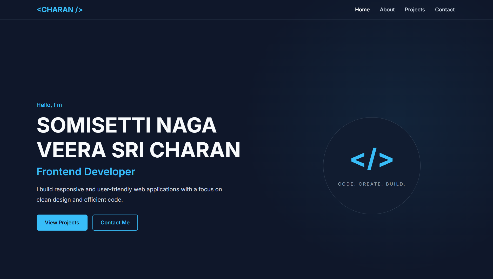
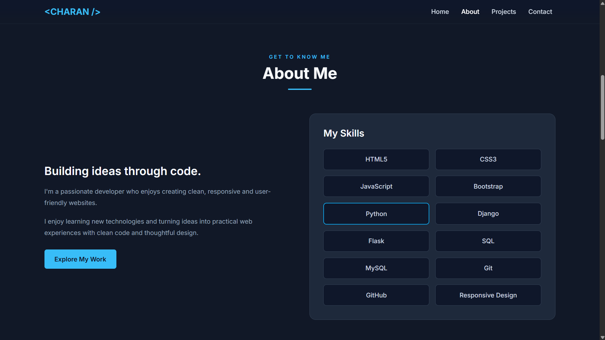
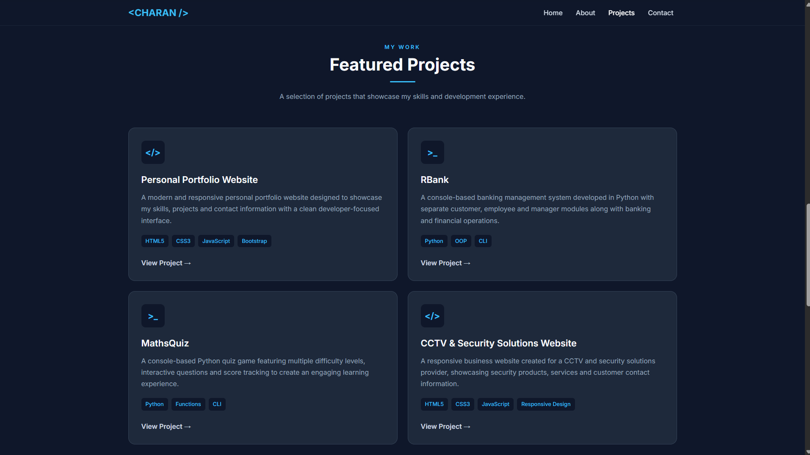
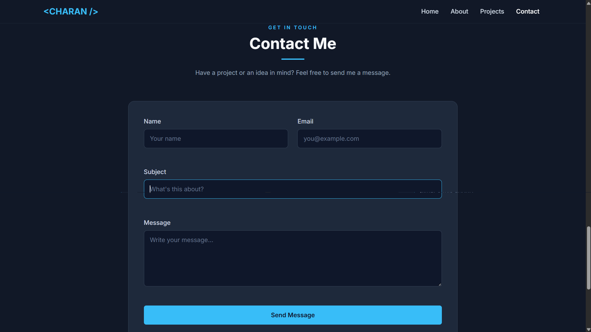
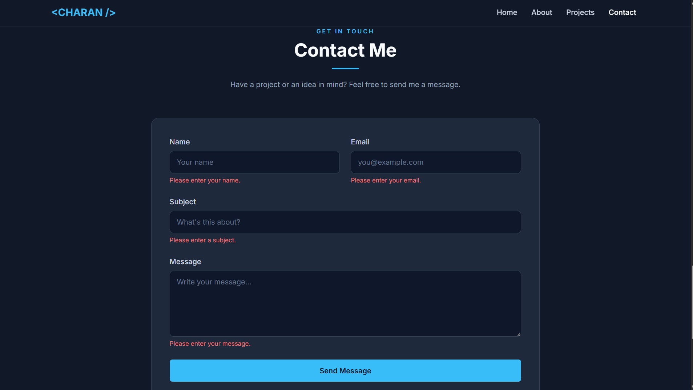
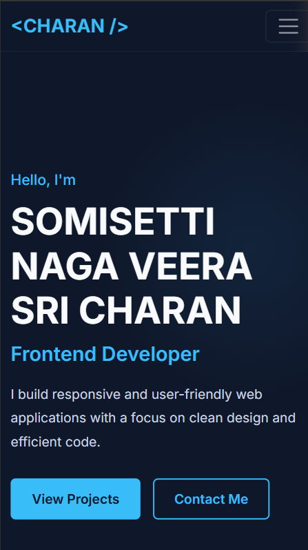

# 💼 Responsive Personal Portfolio Website

> A modern, responsive personal portfolio website built using HTML5, CSS3, Bootstrap 5, and Vanilla JavaScript to showcase developer information, technical skills, projects, and contact details.

This project was developed as part of **Internship Task 1 — Static Portfolio Website**. It demonstrates fundamental front-end development concepts including semantic HTML, responsive layouts, Bootstrap, custom CSS styling, DOM interaction, and client-side form validation.

---

## 📌 Internship Task 1 — Static Portfolio Website

### Description

The objective of this task is to design and develop a **responsive static personal portfolio website** using fundamental front-end technologies.

The website should present developer information in a professional format while demonstrating practical knowledge of:

- HTML5
- CSS3
- Bootstrap 5
- JavaScript
- Responsive Web Design

For this task, I developed a complete personal portfolio containing a Hero section, About section, Skills section, Projects showcase, Contact form, and responsive Footer.

---

## 🎯 Project Objective

The primary objective of this project is to create a visually appealing and responsive portfolio website that demonstrates fundamental front-end development skills.

The project focuses on:

- Creating structured webpages using HTML5
- Designing a professional interface using CSS3
- Building responsive layouts with Bootstrap 5
- Creating reusable visual components
- Showcasing technical skills
- Presenting development projects
- Implementing interactive functionality using JavaScript
- Validating user input
- Supporting desktop, tablet, and mobile devices
- Following basic accessibility and SEO practices

---

## 📖 Project Overview

The **Responsive Personal Portfolio Website** is designed to provide a professional online presence for a developer.

The website presents personal introduction, development interests, technical skills, selected projects, and contact information through a modern dark-themed interface.

Bootstrap 5 and custom CSS are used together to create responsive layouts, while Vanilla JavaScript provides interactive functionality such as contact-form validation.

The portfolio is fully static and does not require a backend or database.

---

## ✨ Features

### 🏠 Portfolio Interface

- Modern developer-focused dark theme
- Responsive navigation bar
- Full-screen Hero section
- Professional introduction
- Call-to-action buttons
- Smooth section navigation

### 👨‍💻 Developer Information

- About section
- Development interests
- Professional goals
- Technical skills presentation
- Technology showcase

### 📂 Projects

- Responsive project cards
- Project descriptions
- Technologies used
- Project links
- Hover interactions
- Mobile-friendly project layout

### 📧 Contact

- Contact form
- Name validation
- Email validation
- Subject validation
- Message validation
- Error feedback
- Success feedback
- Automatic form reset after successful validation

### 📱 User Experience

- Responsive Bootstrap navigation
- Mobile hamburger menu
- Smooth scrolling
- Hover effects
- CSS transitions
- Responsive typography
- Mobile-friendly interface
- Professional footer
- External project/profile links
- Favicon support
- Basic accessibility improvements
- Basic SEO metadata

---

## 🧩 Website Sections

### 1. Navigation Bar

The website includes a responsive Bootstrap navigation bar that provides quick access to the major portfolio sections.

Navigation links allow users to move between:

- Home
- About
- Skills
- Projects
- Contact

On smaller devices, the navigation collapses into a mobile-friendly menu.

---

### 2. Home / Hero Section

The Hero section introduces the developer and provides a short professional description.

It includes prominent call-to-action buttons that guide visitors toward important portfolio sections.

The Hero section is designed to create a strong first impression while remaining responsive across different devices.

---

### 3. About Section

The About section provides information about:

- Development interests
- Technical background
- Professional goals
- Areas of focus

The content is organized for easy readability on desktop and mobile screens.

---

### 4. Skills Section

The Skills section presents technical knowledge and development technologies using a clean and responsive layout.

The section helps visitors quickly understand the technologies and tools used by the developer.

---

### 5. Projects Section

The Projects section showcases selected development work using responsive project cards.

Each project can include:

- Project title
- Description
- Technologies used
- Repository or project link

Featured projects include:

- Personal Portfolio Website
- RBank — Console-Based Banking Management System
- MathsQuiz — Console-Based Python Quiz Application
- CCTV & Security Solutions Website

---

### 6. Contact Section

The Contact section provides a structured form containing:

- Name
- Email
- Subject
- Message

JavaScript performs client-side validation before accepting the form.

---

### 7. Footer

The footer contains:

- Portfolio branding
- Quick navigation links
- Social/profile links
- Copyright information

The footer also adapts to smaller screen sizes.

---

## 🧠 Concepts Demonstrated

### Semantic HTML

HTML5 elements are used to organize the website into meaningful sections and improve document structure.

The portfolio follows a clear hierarchy containing navigation, content sections, forms, and footer information.

---

### Responsive Web Design

The website adapts to multiple screen sizes using:

- Bootstrap responsive utilities
- Bootstrap grid system
- CSS Flexbox
- CSS Grid
- Custom media queries
- Flexible dimensions
- Responsive typography

---

### Bootstrap Grid System

Bootstrap 5 provides the responsive layout foundation for several sections.

Rows and columns automatically reorganize based on the available viewport width.

---

### DOM Manipulation

Vanilla JavaScript interacts with form elements and validation messages through the DOM.

This allows the interface to provide immediate feedback based on user input.

---

### Event Handling

JavaScript event handling is used to respond to actions such as:

- Contact form submission
- User input
- Validation events
- Navigation interactions

---

### Form Validation

Client-side validation prevents incomplete or incorrectly formatted information from being accepted.

The validation checks:

- Required fields
- Email format
- Message length
- Valid form completion

---

## ⚡ Contact Form Validation

The Contact form uses Vanilla JavaScript to validate user input before accepting the submission.

### Validation Process

```text
User submits form
        ↓
Check required fields
        ↓
Empty field?
 ├── Yes → Display error
 └── No
        ↓
Validate email format
        ↓
Invalid email?
 ├── Yes → Display email error
 └── No
        ↓
Check message length
        ↓
Too short?
 ├── Yes → Display message error
 └── No
        ↓
Valid Form
        ↓
Display success message
        ↓
Reset form
```

### Validation Includes

- Required-field validation
- Email-format validation
- Minimum message-length validation
- Error messages
- Success message
- Form reset after successful validation

> **Note:** The current implementation performs client-side validation only. The submitted information is not sent to or stored on a server.

---

## 🛠️ Technologies Used

| Technology | Purpose |
|---|---|
| HTML5 | Website structure and semantic content |
| CSS3 | Custom styling and responsive design |
| Bootstrap 5 | Responsive grid, navigation, forms, buttons, and utilities |
| Vanilla JavaScript | Interactive functionality and form validation |
| CSS Flexbox | Flexible component layouts |
| CSS Grid | Grid-based layouts |
| Git | Version control |
| GitHub | Source code hosting |

---

## 📂 Project Structure

```text
Portfolio/
│
├── assets/
│   └── images/
│       └── favicon.png
│
├── css/
│   └── style.css
│
├── js/
│   └── script.js
│
├── Output/
│   ├── homepage.png
│   ├── about-skills.png
│   ├── projects.png
│   ├── contact-form.png
│   ├── form-validation.png
│   └── mobile-view.png
│
├── index.html
└── README.md
```

---

## 📸 Screenshots

### 🏠 Home Page

The homepage screenshot demonstrates the responsive navigation bar and Hero section.



---

### 👨‍💻 About & Skills

The About and Skills sections present developer information, interests, and technical capabilities.



---

### 📂 Projects

The Projects section showcases selected development work using responsive project cards.



---

### 📧 Contact Form

The Contact section allows visitors to enter their name, email, subject, and message.



---

### ✅ Form Validation

The validation screenshot demonstrates JavaScript-based user-input validation and feedback.



---

### 📱 Mobile View

The portfolio adapts to smaller screens with responsive navigation, content layouts, typography, and spacing.



---

## 💡 How the Portfolio Works

### 1. Navigate Through Sections

Visitors can use the navigation bar to move between different sections of the portfolio.

Smooth scrolling provides a cleaner navigation experience.

---

### 2. Explore Developer Information

The About and Skills sections provide information about development interests, technical knowledge, and professional goals.

---

### 3. Explore Projects

Visitors can browse selected projects through responsive project cards.

Project cards provide information about the project and the technologies used.

---

### 4. Contact the Developer

Visitors can complete the Contact form by entering:

```text
Name
Email
Subject
Message
```

JavaScript validates the entered information before displaying a success response.

---

## 📱 Responsive Design

The portfolio is designed to work across:

- Desktop computers
- Laptops
- Tablets
- Mobile phones

Responsive techniques include:

- Bootstrap 5 grid system
- Responsive navigation
- CSS Flexbox
- CSS Grid
- Custom media queries
- Flexible content widths
- Responsive project cards
- Adaptive typography
- Mobile-friendly spacing
- Responsive forms

On smaller screens:

- Navigation changes to a mobile menu
- Sections adjust to available width
- Project cards reorganize
- Typography scales appropriately
- Form fields remain accessible
- Footer content adapts to the screen

---

## 🧪 Testing Performed

The website was tested for:

- Navigation functionality
- Internal section links
- Desktop layout
- Laptop layout
- Tablet layout
- Mobile layout
- Responsive navigation
- Project card layout
- Button functionality
- External links
- Contact form submission
- Empty-field validation
- Invalid email validation
- Message-length validation
- Successful form validation
- Form reset
- Hover effects
- Smooth scrolling
- Footer navigation

---

## ♿ Accessibility & SEO

Basic accessibility and SEO considerations were included in the project.

These include:

- Semantic HTML structure
- Form labels
- Descriptive page content
- Responsive typography
- Keyboard-accessible form controls
- Page title
- Meta description
- Favicon support
- Appropriate content hierarchy

Further accessibility and SEO improvements can be added in future versions.

---

## 🎯 Learning Outcomes

Through this project, I practiced:

- Creating semantic HTML webpages
- Structuring multi-section websites
- Styling websites using CSS3
- Working with Bootstrap 5
- Using the Bootstrap grid system
- Creating responsive navigation
- Working with CSS Flexbox
- Working with CSS Grid
- Creating responsive project cards
- Designing responsive forms
- DOM manipulation with JavaScript
- JavaScript event handling
- Form validation
- Email validation
- Working with regular expressions
- Providing validation feedback
- Creating responsive interfaces
- Designing mobile-friendly layouts
- Organizing front-end project files
- Using Git and GitHub
- Documenting front-end projects professionally

---

## 🚀 Deployment

The portfolio is a static website and can be deployed using platforms such as:

- Cloudflare Pages
- Netlify
- GitHub Pages

### Live Website

**Live Demo:** https://portfolio.charansomisetti56.workers.dev/

### Source Code

**GitHub Repository:** https://github.com/charansomisetti144-eng/portfolio.git

---

## 🔮 Future Improvements

Possible future enhancements include:

- Connecting the contact form to an email service
- Backend contact-form processing
- Additional portfolio projects
- Live project demo links
- Downloadable resume
- Advanced animations
- Page transition effects
- Dark/light theme toggle
- Improved SEO
- Additional accessibility improvements
- Performance optimization
- Custom domain
- Dynamic project data

---

## ✅ Internship Task Status

**Task 1: Static Portfolio Website — Completed**

| Requirement | Status |
|---|---|
| Create a static portfolio website | ✅ Completed |
| Use HTML5 | ✅ Completed |
| Use CSS3 | ✅ Completed |
| Use Bootstrap 5 | ✅ Completed |
| Add JavaScript functionality | ✅ Completed |
| Create responsive layouts | ✅ Completed |
| Add portfolio sections | ✅ Completed |
| Create Projects section | ✅ Completed |
| Implement Contact form | ✅ Completed |
| Implement form validation | ✅ Completed |
| Mobile-friendly interface | ✅ Completed |
| Project documentation | ✅ Completed |

### Additional Features Implemented

- Modern dark developer theme
- Responsive Bootstrap navigation
- Smooth scrolling
- Project showcase
- Email-format validation
- Message-length validation
- Error and success feedback
- Hover effects and transitions
- Responsive footer
- External profile/project links
- Basic accessibility improvements
- Basic SEO metadata
- Favicon support

---

## 👨‍💻 Author

**SOMISETTI NAGA VEERA SRI CHARAN**

Developed as part of a **Front-End Development Internship — Task 1: Static Portfolio Website**.

---

## 📄 Note

This portfolio was created for educational and internship demonstration purposes.

The current Contact form demonstrates **client-side validation only** and does not transmit or store submitted information on a backend server.

---

## 📄 License

This project was created for **educational and internship demonstration purposes**.